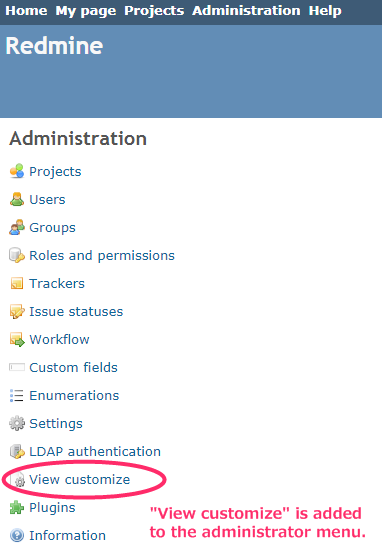
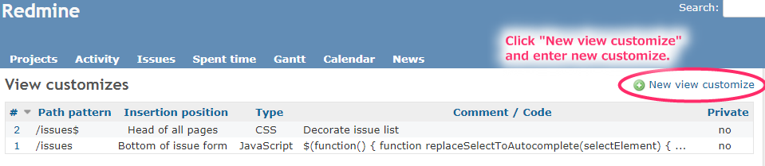
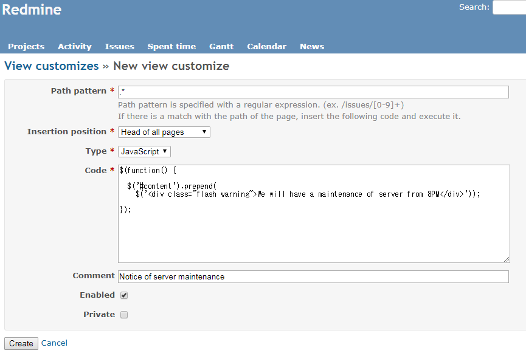
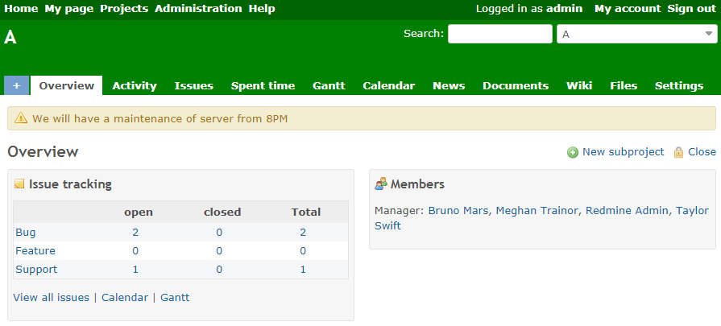
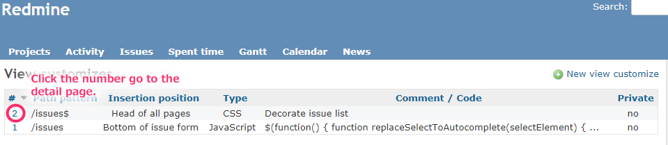
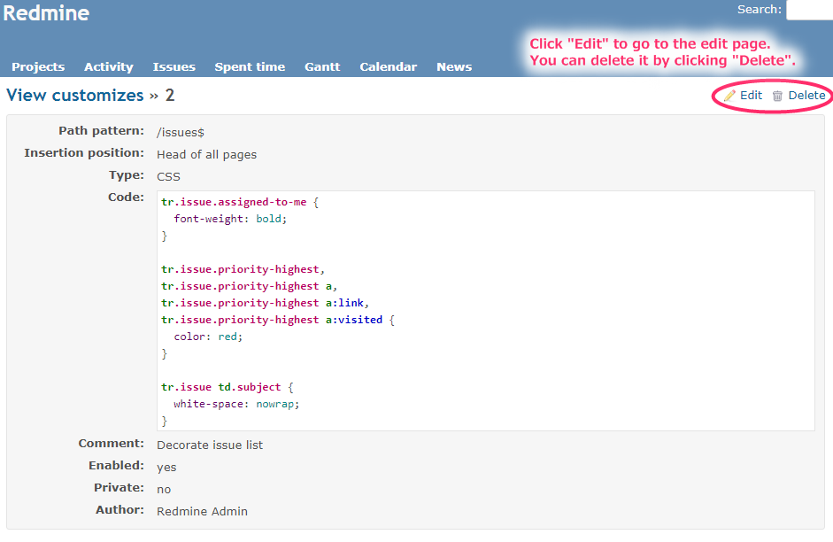
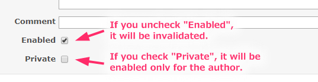
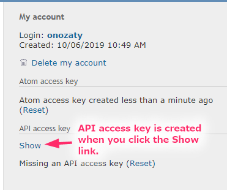
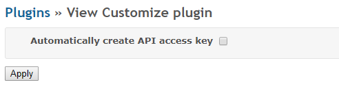

# Redmine view customize plugin

[](https://dl.circleci.com/status-badge/redirect/gh/onozaty/redmine-view-customize/tree/master)

[Redmine](http://www.redmine.org)の画面をカスタマイズするためのプラグインです。

## 機能

条件に一致した画面に対して、JavaScript、CSS、HTMLを埋め込むことで、画面をカスタマイズします。

## インストール方法

Redmineのプラグインディレクトリに、このリポジトリを`view_customize`としてクローンします。

```
cd {RAILS_ROOT}/plugins
git clone https://github.com/onozaty/redmine-view-customize.git view_customize
cd ../
bundle install --without development test
bundle exec rake redmine:plugins:migrate RAILS_ENV=production
```

**注意: ディレクトリ名は`view_customize`とする必要があります。ディレクトリ名が異なると、プラグインの実行に失敗します。**

## 使用方法

### 追加

プラグインをインストールすると、管理者メニューに「View customize」が追加されます。



「View customize」を押下すると、一覧画面に遷移します。



「New view customize」を押下し、各種項目を入力します。



「Path pattern」と「Project pattern」を使って、対象のページを指定します。  
どちらも指定されていなかった場合には、全てのページが対象になります。

「Path pattern」は正規表現でパスを指定します。  
「Path pattern」が設定されていた場合、ページのパスが一致しないと、コードが挿入されません。

以下は設定例です。
* `/issues$` : チケット一覧
* `/issues/[0-9]+` : 個々のチケットの内容表示画面

「Project pattern」は正規表現でプロジェクトの識別子を指定します。v2.7.0にて追加された項目になります。  
「Project pattern」が設定されていた場合、プロジェクトが一致しないと、コードが挿入されません。

「Insertion position」は、コードの挿入位置です。v1.2.0にて追加された項目になります。
* 「Head of all pages」 : 全てのページのヘッダ部分。(v1.2.0より前のバージョンと同じ位置)
* 「Bottom of issue form」 : チケットの入力欄の下部。<br>
チケットの入力欄は、トラッカーやステータスを変えると再構成されますが、「Bottom of issue form」を指定しておくと再構成された際に再度実行されるので、入力欄に対する処理はこれを指定すると便利です。
* 「Bottom of issue detail」 : チケットの詳細表示の下部。
* 「Bottom of all pages」 : 全てのページの末尾(HTML body内で一番下の部分)。
* 「Issues context menu」 : チケット一覧のコンテキストメニュー。

該当ページにコードの挿入位置に該当する箇所が無かった場合、コードは埋め込まれません。たとえば、「Path pattern」と「Project pattern」の設定が無く、全ページが対象となっても、「Insertion position」に「Bottom of issue detail」を指定していると、チケットの詳細表示画面でしかコードが実行されないことになります。

「Type」にてコードの種類(「JavaScript」、「CSS」または「HTML」)を選択し、「Code」に実際のコードを入力します。

「Comment」にはカスタマイズに対する概要を記載できます。ここで入力した内容は、一覧表示で表示されます。(Commentが入力されていればComment、Commentが入力されていない場合はCodeが一覧に表示)

「Create」ボタン押下で新規カスタマイズの追加が完了です。

「Path pattern」と「Project pattern」に一致したページで、「Insertion position」で指定した位置にコードが埋め込まれ、画面がカスタマイズされるようになります。



### 編集/削除



カスタマイズ一覧の番号を押下すると、カスタマイズ詳細画面へ遷移します。



「Delete」を押下すると削除できます。「Edit」を押下すると、編集画面へ遷移します。

入力項目は新規カスタマイズ作成時と同じです。

### 無効化 / プライベート

「Enabled」のチェックを外すと、無効化することができます。「Private」をチェックすると、作成者のみに有効となります。



まずは「Private」で動作確認したうえで、動作に問題なければ全体に公開するといった使い方ができます。

### ViewCustomize.context (JavaScript)

JavaScriptのコードでは、`ViewCustomize.context`としてユーザやプロジェクトの情報にアクセスすることができます。

`ViewCustomize.context`の情報は下記のようなイメージです。

```javascript
ViewCustomize = {
  "context": {
    "user": {
      "id": 1,
      "login": "admin",
      "admin": true,
      "firstname": "Redmine",
      "lastname": "Admin",
      "mail": "admin@example.com",
      "lastLoginOn": "2019-09-22T14:44:53Z",
      "groups": [
        {"id": 5, "name": "Group1"}
      ],
      "apiKey": "3dd35b5ad8456d90d21ef882f7aea651d367a9d8",
      "customFields": [
        {"id": 1, "name": "[Custom field] Text", "value": "text"},
        {"id": 2, "name": "[Custom field] List", "value": ["B", "A"]},
        {"id": 3, "name": "[Custom field] Boolean", "value": "1"}
      ]
    },
    "project": {
      "id": 1,
      "identifier": "project-a",
      "name": "Project A",
      "roles": [
        {"id": 6, "name": "RoleX"}
      ],
      "customFields": [
        {"id": 4, "name": "[Project Custom field] Text", "value": "text"}
      ]
    },
    "issue": {
      "id": 1,
      "author": {"id": 2, "name": "John Smith"},
      "lastUpdatedBy": {"id": 1, "name": "Redmine Admin"}
    }
  }
}
```

例えばユーザのAPIアクセスキーにアクセスするには`ViewCustomize.context.user.apiKey`となります。

### APIアクセスキー

APIアクセスキーは、個人設定画面のAPIアクセスキーの「表示」リンクを初めて押下したタイミングで生成されます。



自動的に生成したい場合には、プラグインの設定画面にて「APIアクセスキーを自動的に作成する」をONにしてください。各ユーザに個人設定画面で操作してもらわなくても、APIアクセスキーが生成されるようになります。



APIアクセスキーの利用には、設定画面の「API」タブにて、「RESTによるWebサービスを有効にする」をONにしておく必要があります。

## 設定例

下記のプロジェクトで設定例を公開しています。

* [onozaty/redmine\-view\-customize\-scripts: Code examples for "Redmine View Customize Plugin"](https://github.com/onozaty/redmine-view-customize-scripts)

コードの書き方がわからない場合には、上記プロジェクトを参考にしてみてください。

試したコードがうまく動かない場合には、上記プロジェクトの [Issue](https://github.com/onozaty/redmine-view-customize-scripts/issues) から質問することが出来ます。  
質問を受け付ける場所であり、コード作成の依頼場所ではありませんのでご注意ください。

## サポートバージョン

* 最新バージョン : Redmine 3.1.x から 3.4.x、4.0.x 以降
* 1.2.2 : Redmine 2.0.x から 3.4.x

## ライセンス

このプラグインは [GNU General Public License](http://www.gnu.org/licenses/gpl-2.0.html) バージョン2またはそれ以降の条件で利用できます。

## 作者

[onozaty](https://github.com/onozaty)

[スポンサー](https://github.com/sponsors/onozaty) となり、本プロジェクトを維持することに貢献していただける方を募集しています。
