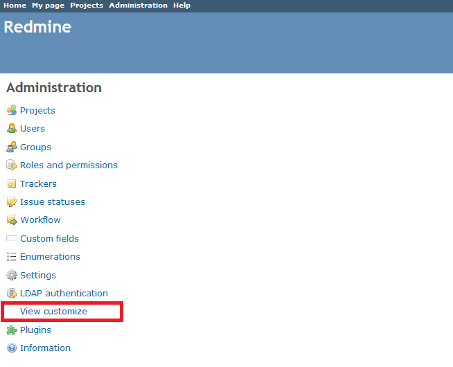
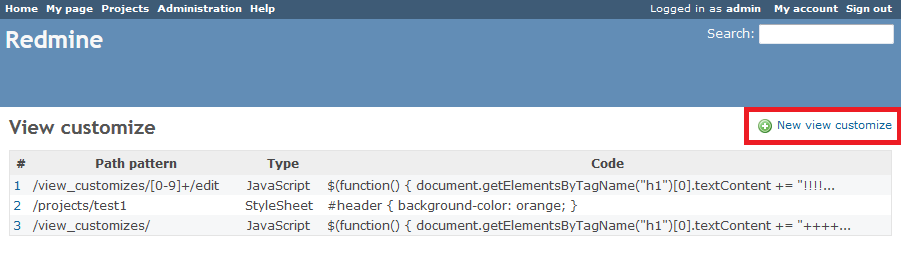
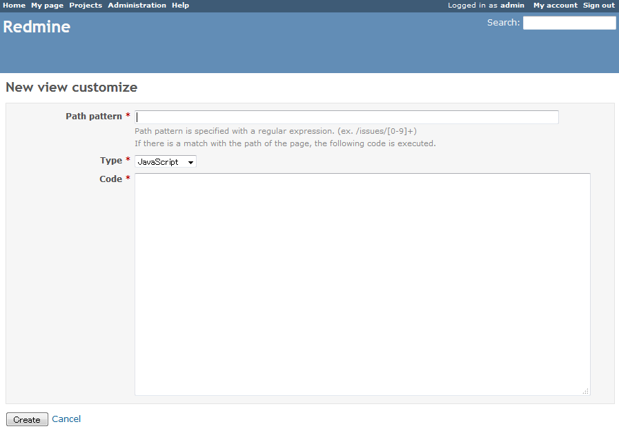
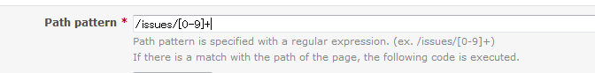
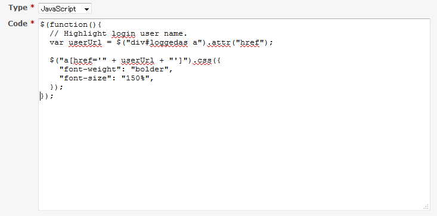
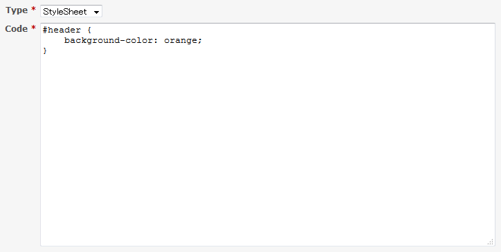
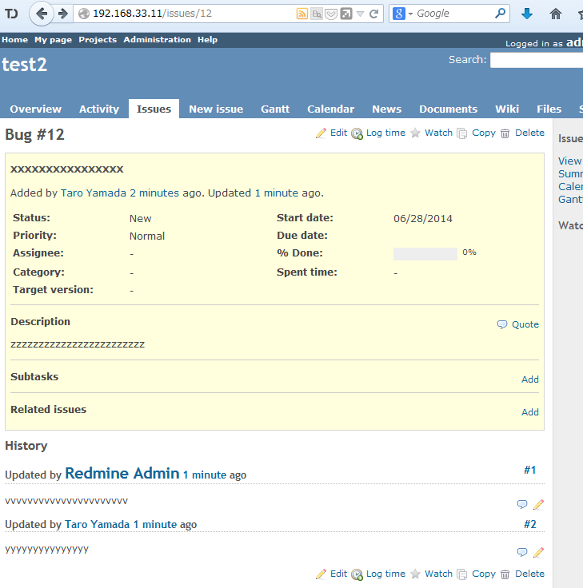
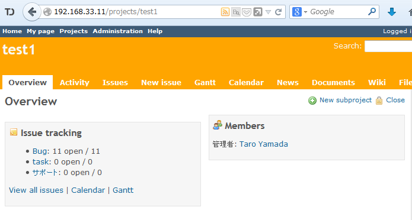

Redmine view customize plugin
===========================

This a plugin allows you to customize the view for the [Redmine](http://www.redmine.org).

Features
------------

By adding JavaScript or CSS to the matched path, a screen is made customizable. 

Installation
------------

Install the plugin in your Redmine plugins directory, clone this repository as `view_customize`:

    cd {RAILS_ROOT}/plugins
    git clone https://github.com/onozaty/redmine-view-customize.git view_customize
    cd ../
    rake redmine:plugins:migrate

Usage
------------

### Setting

1. After you install the Plugin, "View customize" the administrator menu is added.

2. Add a new setting.

3. Path pattern is specified with a regular expression. (ex. /issues/[0-9]+)
If there is a match with the path of the page, the code(JavaScript/StyleSheet) is executed.

4. Input code.

5. Matches the path, StyleSheet or JavaScrpt is embedded, the screen display is changed.

Supported versions
------------------

* Redmine 2.0.x or later

License
-------

The plugin is available under the terms of the [GNU General Public License](http://www.gnu.org/licenses/gpl-2.0.html), version 2 or later.
